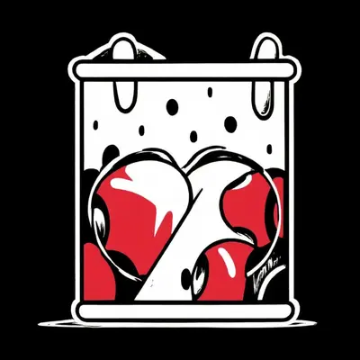

# **DeathPulse — The Art of Strategic Death**

  

**DeathPulse** is a revolutionary Minecraft plugin that redefines what death means in survival gameplay.
In traditional Minecraft, death marks failure — a setback that resets progress. With DeathPulse, however, every death becomes an opportunity.
Players can now *gain or lose health* depending on **how** they die, introducing a deep, tactical layer to both **survival** and **PvP** gameplay.

Built for creativity and challenge, DeathPulse transforms ordinary combat and exploration into a game of calculated risks.
Some deaths may punish recklessness by reducing your health, while others — if faced deliberately — can actually *strengthen* you.
This dynamic system rewards players who understand the dangers of the world and learn to manipulate them to their advantage.

---

## ⚔️ **A New Philosophy of Survival**

DeathPulse introduces the concept of **strategic death** — where mastering the way you die is just as important as mastering how you live.
Server administrators can define specific **death types** that either increase or decrease a player’s health upon death.
For example, a player who dies in lava might lose health permanently, while one who dies from falling could become slightly tougher afterward.

This mechanic gives rise to an entirely new kind of player behavior:
instead of simply avoiding death, players now seek to **optimize** it.
They will experiment, adapt, and evolve — learning which types of deaths to avoid (*Decrease types*) and which to exploit (*Increase types*).
The result is an ecosystem where every loss can become a strategic victory, and every respawn is a chance to grow stronger.

---

## ⚙️ **Fine-Tuned Control for Administrators**

At the heart of DeathPulse lies a highly detailed configuration system that gives server owners unparalleled control.
Using the `config.yml` file, you can define exactly how the plugin behaves in every situation:

* **Death Categories:** Configure “Increase,” “Decrease,” and “Ignore” types to shape gameplay balance.
* **Dynamic Health System:** Set specific health gain or loss values for any death type.
* **Day-Based Logic:** Create special “Increase Days” or “Decrease Days” tied to either Minecraft days or real-world time.
* **Health Debt & Limits:** Enforce minimum and maximum health caps, or introduce a debt mechanic where lost health must later be repaid.
* **Health Items:** Allow players to convert health into tangible, tradeable items that can restore or transfer life force.
* **Seasons & Cycles:** Define cyclical periods (seasons) that reset death histories, giving players new chances to redefine their survival path.

This level of configurability enables server administrators to build unique survival ecosystems — from brutal hardcore worlds where death is devastating, to experimental RPG-style realms where calculated death leads to power.

---

## 🩸 **Gameplay Mechanics that Shape Player Behavior**

DeathPulse doesn’t just alter numbers — it reshapes how players think.

* **Increase Deaths:** Reward risk-takers. Certain deaths grant bonus health, encouraging bold exploration or creative strategies.
* **Decrease Deaths:** Punish carelessness. These deaths reduce maximum health, forcing players to adapt and respect the world’s dangers.
* **Ignore Deaths:** Exempt harmless or routine deaths, preserving fairness and focus on meaningful encounters.
* **Health Items:** Enable an economy of vitality — players can withdraw health to create items, transfer life to others, or trade their essence.
* **Seasonal Cycles:** Allow health systems to refresh periodically, keeping long-term gameplay dynamic and fair.

Together, these mechanics turn simple life-and-death events into a living simulation of survival intelligence — where knowledge, timing, and decision-making matter as much as combat skill.

---

## 🧠 **Complete Administrative Toolkit**

DeathPulse includes a powerful command suite for server management and player moderation:

* `/dp reload` – Reloads the configuration instantly without restarting the server.
* `/dp setConfig` – Adjusts plugin values directly through commands.
* `/dp setMaxHealth`, `/dp resetHealth`, `/dp matchHealth` – Control or synchronize player health values.
* `/dp transferHealth` and `/dp withdrawHealth` – Manage health item transactions between players.
* `/dp viewDeathData` and `/dp viewDebtData` – Monitor how players interact with the death system.
* `/dp removeDeathData` and `/dp removeDebtData` – Remove death or debt data player.

With these tools, administrators maintain total control over gameplay balance while allowing real-time adjustments to match community feedback or event requirements.

---

## 💀 **Why DeathPulse Stands Apart**

DeathPulse is not about punishing players — it’s about **teaching them to adapt**.
By turning death into a mechanic that can be exploited, it encourages experimentation, creativity, and strategic thinking.
Players must weigh every decision:
Will this death cost me strength, or will it make me stronger?

This system introduces a subtle layer of psychology into Minecraft — fear, greed, calculation, and growth all tied to a single moment: the player’s death.
It changes the emotional rhythm of gameplay, transforming every heartbeat into a meaningful choice.

---

## 🌌 **A Living, Breathing Survival Experience**

Whether you run a casual community or a competitive PvP arena, DeathPulse seamlessly integrates into your server’s ecosystem.
It empowers players to forge their own survival narratives, while giving administrators the tools to craft worlds of consequence and depth.

With DeathPulse, death is no longer the end.
It’s the pulse that drives your world forward — one beat, one death, one evolution at a time.

> **Redefine death.**
> **Redefine survival.**
> **Embrace the pulse.**

---

  <a href="#/2.0.0/installation?id=installation-guide" class="nav-button">Next: Installation ➡</a>

